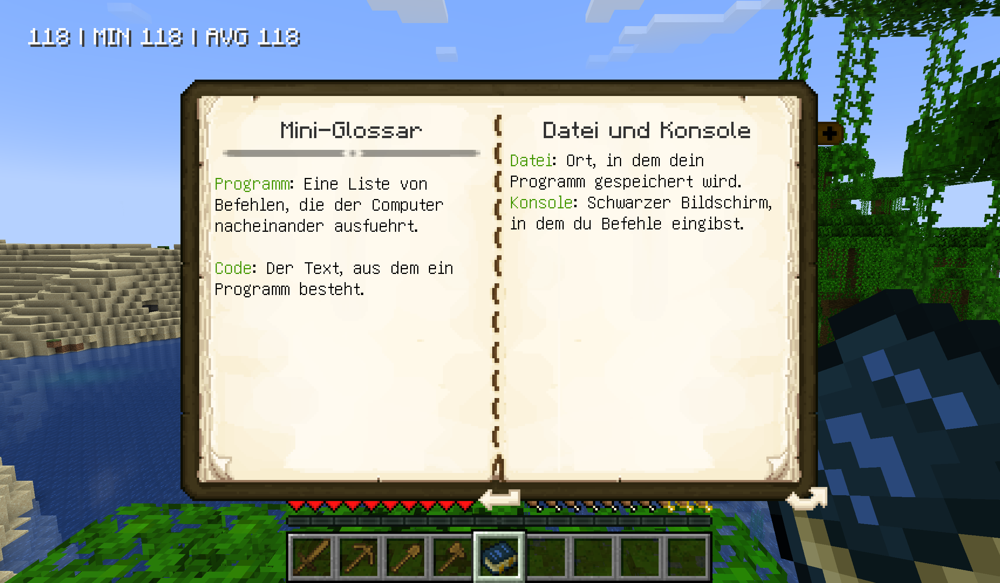
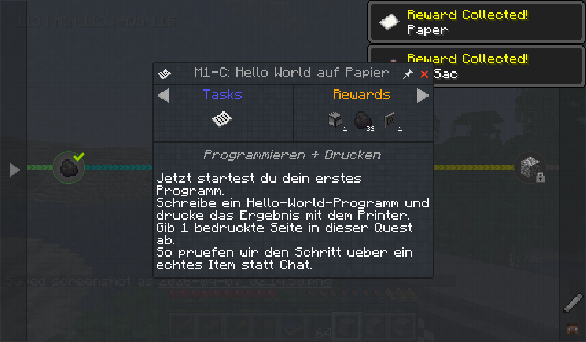

# Blocklabor

[](https://github.com/Tigertycoon/blocklabor/actions/workflows/validate.yml)

**Learning to program through Minecraft.** A German-language workshop prototype that turns programming concepts into quests, in-game instructions and tangible results.



## The learning path

| Module | Practice | Intended learning outcome |
| --- | --- | --- |
| CC:Tweaked | Print Hello World, move a Turtle, build a mini-quarry | Commands, sequencing, loops and debugging |
| Super Factory Manager | Build and explain an automated material flow | Inputs, outputs, dependencies and troubleshooting |
| Psi | Follow spell tutorials and experiment with loopcasting | Visual logic, repetition and state |
| KubeJS | Change a recipe and handle a game event | JavaScript, event-driven behavior and a test/reload workflow |

The course includes **18 quests across four modules**, **21 handbook entries**, Lua/JavaScript examples, facilitator solutions, optional extension tasks and a fresh-player world template.

## My contribution

Niklas / Tigertycoon: workshop concept, learning sequence, quest content and progression, in-game explanations, example solutions, pack integration and the supplied world. The underlying game and third-party mods are credited dependencies. The custom application code is small; the main contribution is the integrated learning experience and its teaching materials.



## Try the workshop

Download `blocklabor-0.1.0.mrpack` from [Releases](https://github.com/Tigertycoon/blocklabor/releases), then import it into Prism Launcher. Use **Java 21**. Minecraft **1.21.1** and NeoForge **21.1.235** are fixed in the pack.

The importer downloads the 133 pinned mod files from their publishers' distribution sources. No mod JARs are stored in this repository. Start the included **Blocklabor Workshop** world or a new world, open FTB Quests, and begin Module 1. The **Blocklabor Kursbuch** is available through Patchouli's creative inventory entry for facilitators.

This is a **workshop prototype**. A facilitator reviews code and explanations: submitting an item does not prove that a learner wrote the intended program. The included pitch originally proposed a pilot; this publication does not claim measured learning outcomes or a completed classroom evaluation.

## Repository layout

- `overrides/`: quests, handbook and custom progress configuration/script.
- `solutions/`: facilitator examples and explanations in German.
- `world-template/`: supplied world with personal progress removed.
- `pack.lock.json`: exact dependency sources, versions, sizes and checksums.
- `tools/`: course validation and reproducible pack packaging.
- [Facilitator guide](docs/facilitator-guide.md) · [Validation](docs/validation.md) · [Credits](CREDITS.md)

## Validate and package

Python 3.12 or newer:

```sh
python -m pip install -r requirements-dev.txt
python tools/validate.py
python tools/build_pack.py
```

The package is written to `dist/`. Existing screenshots are used to show the concept; no new demonstration video is required to inspect the course sources.

## License

The authored course content, examples and world export are [MIT licensed](LICENSE). Minecraft and third-party mods retain their own licenses and are downloaded separately. This is an independent project, not an official Mojang, Microsoft or TUMO release.
